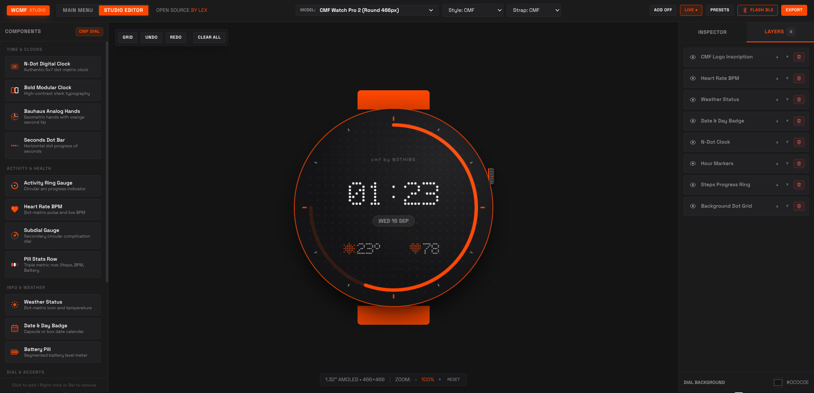

<div align="center">
  
  <p align="center">
    <strong>Web-based watchface designer and Bluetooth BLE flasher for CMF by Nothing smartwatches</strong>
  </p>
  <p align="center">
    <a href="https://lexp-hub.github.io/wcmf/"></a>
    
    
    
    
    
    
  </p>
</div>

<br>

# WCMF — Watchface Studio for CMF

> **Web-based watchface designer and BLE flasher for CMF Watch Pro 2, Watch 3 Pro, Watch Pro & Band.**  
> Open source watchface design studio and Bluetooth OTA flasher for CMF smartwatches by Lex.

🌐 **Live Web Studio:** [https://lexp-hub.github.io/wcmf/](https://lexp-hub.github.io/wcmf/)

### Supported Devices
- **CMF Watch Pro 2**: 1.32" Round AMOLED (466×466)
- **CMF Watch 3 Pro**: 1.43" Round AMOLED (466×466)
- **CMF Watch Pro**: 1.96" Squircle AMOLED (410×502)
- **CMF Watch Band / Compact**: 1.64" Rectangular AMOLED (280×456)

> [!CAUTION]
> **Hardware & Pairing Warning**: Direct Bluetooth pairing, authentication handshakes, and watchface flashing carry inherent risks of **softbrick** or **accidental/random device factory resets**. Proceed at your own risk and ensure your watch is sufficiently charged before attempting pairing or flashing.

> [!WARNING]
> **Maintenance Disclaimer**: This project is provided as an open-source tool as-is. Active ongoing maintenance, regular feature updates, or guaranteed compatibility with future firmware releases are not assured.

---

## Features

- **Direct Bluetooth OTA Flashing**: Connect and transfer compiled `.bin` watchface files directly to your CMF Watch via the browser Web Bluetooth API (`navigator.bluetooth`).
- **Multi-Device Support**: Support for circular, squircle, and rectangular CMF watch models with live case and bezel styling.
- **N-Dot Matrix Typography**: Bitmapped 5×7 and 7×9 font rendering for digital clocks, fitness metrics, battery counters, and date capsules.
- **Modular Components**: Drag-and-drop layer placement, sub-dials, activity rings, BPM gauges, weather indicators, and analog hands.
- **Live Clock & AOD Simulation**: Real-time ticking hands and Always-On Display preview.
- **Official .BIN Export**: Zephyr RTOS TLV binary generator with 16-bit RGB565 framebuffer, `face.json` manifest, and CRC32 checksum.
- **Image & Project Export**: Multi-scale PNG exports (1x, 2x, 4x) and full project JSON save/restore.

---

## Complications & Dial Components

| Category | Component | Description |
| :--- | :--- | :--- |
| **Time & Clocks** | `N-Dot Digital Clock` | Iconic 5×7 dot-matrix clock with configurable dot size and 12h/24h modes |
| | `Bold Modular Clock` | High-contrast stark typographic digital clock with classic serif styling |
| | `Bauhaus Analog Hands` | Industrial dual-tone hour/minute hands with signature orange second indicator |
| | `Seconds Dot Bar` | Horizontal dot-matrix progress strip indicating real-time seconds |
| **Activity & Health** | `Activity Ring Gauge` | Segmented circular arc progress gauge for steps, calories, or active minutes |
| | `Heart Rate BPM` | Live heart rate monitor with dot-matrix pulse wave and BPM metric |
| | `Subdial Gauge` | Mechanical chronograph sub-dial with dual tick rings and rotating hand |
| | `Pill Stats Row` | Triple horizontal capsule badge showing steps, active calories, and battery % |
| **Info & Weather** | `Weather Status` | Dot-matrix weather condition icon (sun, rain, cloud, snow) with live temperature |
| | `Battery Capsule` | Segmented 3-dot battery indicator pill with percentage readout |
| | `Date & Day Badge` | Pill/capsule date badge with localized day and month formatting |
| **Grid & Accents** | `Dial Tick Ring` | Precision hour and minute tick marks with custom major/minor accent colors |
| | `Background Dot Grid` | Subtle geometric circular dot-matrix pattern dial texture |

---

## Studio Controls & Hotkeys

| Action | Shortcut / Control | Description |
| :--- | :--- | :--- |
| **Delete Element** | `Delete` or `Backspace` | Instantly delete the currently selected layer |
| **Fast Context Action** | `Right-Click` on canvas | Open contextual action menu (Delete, Bring to Front, Send to Back) |
| **Undo / Redo** | `Ctrl + Z` / `Ctrl + Y` | Revert or reapply previous canvas changes |
| **Canvas Zoom** | `Zoom Slider` / `Reset` | Scale workspace from 50% to 150% without dial distortion |
| **AOD Preview** | `AOD Toggle` | Switch between active mode and low-power Always-On Display |
| **Live Engine** | `Live / Freeze` | Toggle live ticking clock vs static preview mode |

---

## Quick Start

### 🚀 Use Online (No Installation Needed)
Access the live studio directly in any Web Bluetooth supported browser (Chrome, Edge, Brave, Opera):
👉 **[https://lexp-hub.github.io/wcmf/](https://lexp-hub.github.io/wcmf/)**

---

### 💻 Run Locally

#### 1. Clone the repository
```bash
git clone https://github.com/lexp-hub/wcmf.git
cd wcmf
```

#### 2. Start the local development server
```bash
# Python 3
python3 -m http.server 8080

# Or with Node.js
npx serve -l 8080
```

#### 3. Open in Browser
Navigate to [http://localhost:8080](http://localhost:8080) to start designing.

---

## License
Released under the [MIT License](LICENSE).
